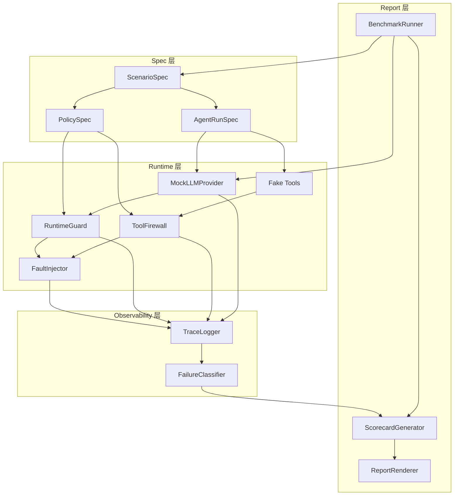

# 架构设计

## 总体架构

AgentReliabilityHarness 采用 **Spec-Driven** 架构。所有行为由声明式配置（YAML/JSON）驱动，运行时模块按职责分层，数据单向流动。

整体分为 4 层：

1. **Spec 层**：定义场景、Agent 运行参数、策略规则
2. **Runtime 层**：Mock Agent 执行引擎、Guard、Firewall、FaultInjector
3. **Observability 层**：TraceLogger、FailureClassifier
4. **Report 层**：BenchmarkRunner、ScorecardGenerator、ReportRenderer

## 架构图

## 核心模块职责

### Spec 层

| 模块 | 职责 | 输入 | 输出 |
|------|------|------|------|
| **ScenarioSpec** | 定义一个完整的评测场景 | YAML 文件 | 结构化场景对象 |
| **AgentRunSpec** | 定义 Agent 运行参数（模型、工具、budget） | ScenarioSpec 字段 | Agent 配置 |
| **PolicySpec** | 定义运行时策略（允许的模型、工具风险等级、token 上限） | ScenarioSpec 字段 | 策略规则集 |

### Runtime 层

| 模块 | 职责 | 输入 | 输出 |
|------|------|------|------|
| **MockLLMProvider** | 模拟 LLM 返回，支持预设响应和故障模拟 | AgentRunSpec | 模拟的 LLM response |
| **Fake Tools** | 模拟工具执行，不产生真实副作用 | Tool call 请求 | 模拟的工具执行结果 |
| **RuntimeGuard** | 运行时策略守卫，检查 model / budget / 通用规则 | PolicySpec + 运行时事件 | GuardDecision |
| **ToolFirewall** | 工具调用防火墙，按风险等级拦截 | PolicySpec + tool call | GuardDecision |
| **FaultInjector** | 主动注入运行时故障 | 故障注入配置 | 模拟的异常/超时/错误 |

### Observability 层

| 模块 | 职责 | 输入 | 输出 |
|------|------|------|------|
| **TraceLogger** | 记录所有运行时事件为 JSONL 格式 | 所有模块的事件 | trace.jsonl |
| **FailureClassifier** | 分析 trace 事件流，分类故障类型 | trace 事件 | FailureType 枚举 |

### Report 层

| 模块 | 职责 | 输入 | 输出 |
|------|------|------|------|
| **BenchmarkRunner** | 批量运行场景并收集结果 | 场景列表 | 运行结果集 |
| **ScorecardGenerator** | 汇总结果生成评分卡 | 运行结果 + 分类结果 | scorecard.json |
| **ReportRenderer** | 将评分卡渲染为人类可读报告 | scorecard.json | report.md / report.html |

## 为什么 Offline-First

1. **可复现性**：Agent 行为受 LLM 随机性影响极大，online 调用无法精确复现同一故障
2. **成本控制**：MVP 阶段不需要消耗 API token，零成本反复调试
3. **速度**：Mock 运行毫秒级完成，10 个场景全量跑完 < 1 秒
4. **CI 友好**：不需要 API Key、网络访问、外部服务
5. **安全**：不会因为 prompt injection 场景意外调用真实 API

后续可通过 adapter 接入真实 LLM provider，但 offline mock 始终是默认模式。

## 为什么第一版使用 MockLLMProvider 和 Fake Tools

### MockLLMProvider

- 每个场景通过 `AgentRunSpec.mock_responses` 预设 LLM 返回内容
- 支持模拟：正常响应、超时、错误码、token 超额
- 返回格式与真实 LLM API 一致（model, content, usage, finish_reason）

### Fake Tools

- 每个工具有预设执行结果，不产生真实副作用
- 工具元数据包含风险等级（safe / low / high / critical），供 ToolFirewall 决策
- 示例：`read_file`, `write_file`, `execute_shell`, `search_web`, `send_email`

| 真实 API 的问题 | Mock 的优势 |
|-----------------|-------------|
| 结果不可控 | 完全可控，精确复现 |
| 需要 API Key | 零配置 |
| 有成本 | 零成本 |
| 安全风险 | 完全隔离 |

## 为什么不是已有工具的简单套壳

| 比较对象 | 它的定位 | ARH 的区别 |
|----------|----------|-----------|
| AgentGateway | 线上流量管控网关 | ARH 是离线评测框架 |
| MCPGuard | MCP 协议安全中间件 | ARH 不依赖 MCP 协议 |
| AgentTraceLab | Trace 可视化分析 | ARH 侧重故障复现+分类+评分 |

ARH 核心价值在于 **Spec → Guard → Fault → Trace → Classify → Score** 的完整评测链路。

## 和 Coding Agent Harness 的区别

| 维度 | Coding Agent Harness | AgentReliabilityHarness |
|------|---------------------|------------------------|
| **目标** | 评测 Agent 修代码能力 | 评测 Runtime 可靠性 |
| **输入** | GitHub issue + 代码仓库 | ScenarioSpec (YAML) |
| **被测对象** | 代码修复质量 | 防护和容错机制 |
| **评测方式** | 跑 pytest 看是否修好 | 看 Guard 拦截、Trace 完整性、分类正确性 |
| **故障来源** | 代码 bug | FaultInjector 主动注入 |
| **输出** | patch + test results | trace + scorecard + report |

## 后续可选 Adapter

以下 adapter 不在 MVP 范围内，但架构预留扩展点：

- **LiteLLMAdapter**：替换 MockLLMProvider，接入 100+ 真实 LLM provider
- **MCPToolAdapter**：替换 Fake Tools，接入真实 MCP server
- **LangfuseExporter**：将 trace.jsonl 导出到 Langfuse 进行可视化
- **PromptfooImporter**：从 Promptfoo 评测配置中导入场景定义
